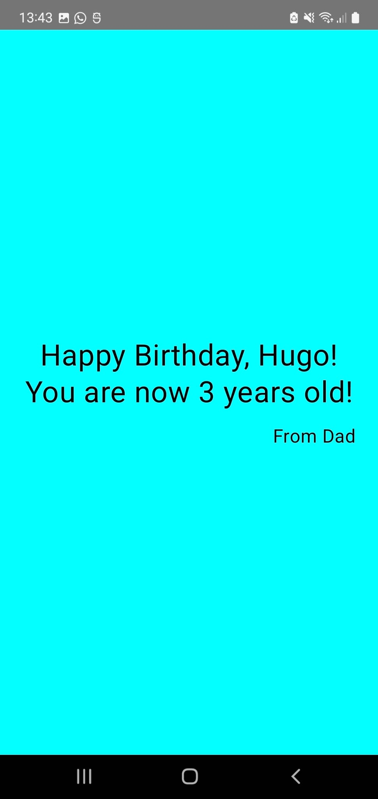

# Android Greeting App

A simple Android app built with **Kotlin** and **Jetpack Compose**.  
The app displays a greeting message with a customizable name on a full cyan background.

---

## Features

- Fully implemented with **Jetpack Compose**.
- Flexible `Greeting` function to change the displayed name.
- Clean and minimal design with a full-screen cyan background.
- Simple, readable, and reusable code structure.

---

## Screenshot



> Replace `screenshot.png` with the actual image you capture from your emulator or device.

---

## How to Run

1. Clone the repository:

```bash
git clone https://github.com/criptowaco/android-greeting-app.git

2. Open the project in Android Studio
3. Build and run the app on an emulator of physical device.

---

## Usage

- The greeting message is defined in MainActivity.kt
- You can change the displayed name by editing: GreetingScreen(name = "Your Name")

---

## Technology Stack

- Kotlin
- Jetpack Compose
- Android Studio
- Material3

---

## License

This project is licensed under the MIT License.
