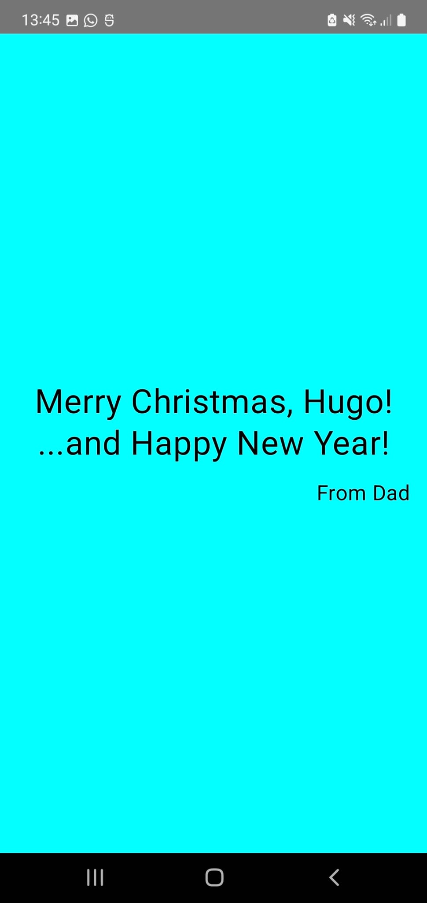

# [Android Greeting App](https://github.com/criptowaco/android-greeting-app)

A simple Android app built with **Kotlin** and **Jetpack Compose**.  
The app displays greeting messages with a customizable name on a full cyan background, with an option to easily switch between Birthday and Christmas greetings.

## Motivation

This project was created to practice **Android development with Kotlin** and **Jetpack Compose**, focusing on writing clean, reusable code and learning how to publish apps. It’s a first step toward becoming a professional Android developer and showcases progress on GitHub. The app now includes multiple greeting types, styled text, and a layout inspired by the official Google codelabs.

## Features

- Fully implemented with **Jetpack Compose**.
- Birthday and Christmas greetings.
- Easy to switch the displayed message by commenting/uncommenting a single line in `MainActivity.kt`.
- Clean and minimal design with a full-screen cyan background.
- Text styling with large titles, line height, and alignment for a more polished look.
- Simple, readable, and reusable code structure.

## Screenshot

**Birthday Greeting**

**Christmas Greeting**

## How to Run

1. Clone the repository: `git clone https://github.com/criptowaco/android-greeting-app.git`
2. Open the project in Android Studio
3. Build and run the app on an emulator or physical device.

## Usage

- The greeting message is defined in `MainActivity.kt`
- Switch between Birthday and Christmas greeting by commenting/uncommenting the corresponding line inside `Surface`.
- Change the displayed name or age directly in the code to customize your greetings.

## Technology Stack

- Kotlin
- Jetpack Compose
- Android Studio
- Material3

## License

This project is licensed under the MIT License.
